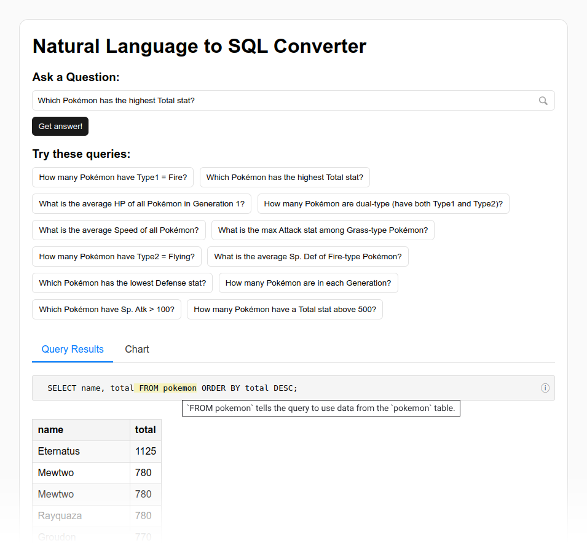
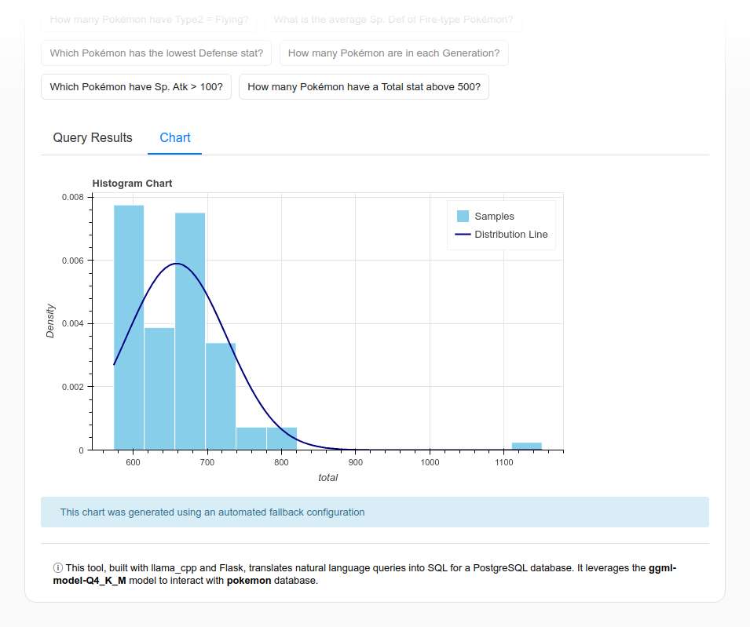
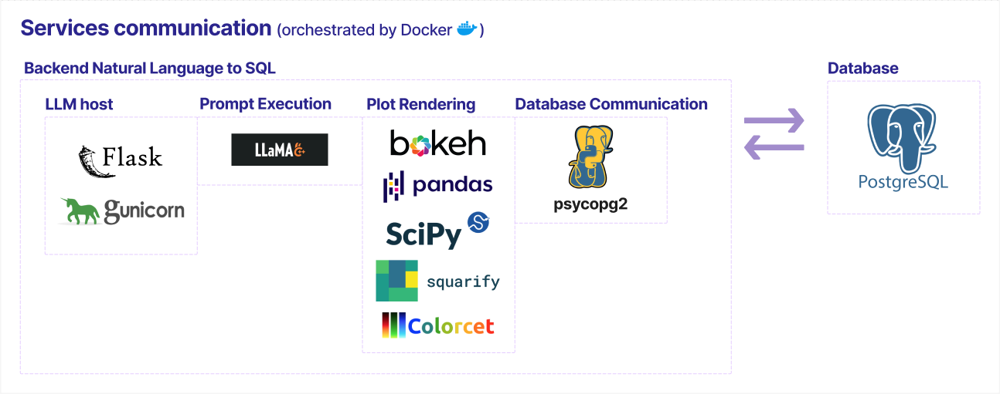

# 🔎🤖 Natural Language to SQL Converter

This repository provides a system for retrieving data from a database using queries written in natural language.

It offers an open-source environment for experimenting with LLM-powered database search. It includes a server setup for running different models, sample code for integrating them into applications, and a Postgres service as the database.

For demonstration purposes, the <a href="https://github.com/lgreski/pokemonData/blob/master/Pokemon.csv"></a> dataset was used.

Key features of the application include:
- Querying the database using natural language input.
- Generating visualizations by the LLM from predefined plot types.
- Automatic fallback logic to select relevant plots when the LLM fails.
- LLM-generated tooltips explaining different parts of the SQL query.
- Natural language description of the database generated by the LLM.

<br>


<br>



## 🗂️ Project Structure



### 📚 Key Libraries

**LLM Host:**

- [**`flask`**](https://flask.palletsprojects.com/)
  
  _Lightweight web framework to handle HTTP requests and route interactions with the LLM._

- [**`gunicorn`**](https://gunicorn.org/)
  
  _WSGI HTTP server used to serve the Flask app in a production environment._

**Prompt Execution:**

- [**`llama-cpp-python`**](https://github.com/abetlen/llama-cpp-python)
  
  _Python bindings for running LLaMA models locally for prompt execution._

**Plot Rendering:**

- [**`bokeh`**](https://docs.bokeh.org/en/latest/)
  
  _Interactive plotting library for rendering visualizations in the browser._

- [**`pandas`**](https://pandas.pydata.org/)
  
  _Data manipulation library used for preparing datasets before visualization._

- [**`scipy`**](https://scipy.org/)
  
  _Provides advanced math operations to support plot-related calculations._

- [**`squarify`**](https://github.com/laserson/squarify)
  
  _Used for generating treemap visualizations based on hierarchical data._

- [**`colorcet`**](https://colorcet.holoviz.org/)
  
  _Color palettes used to enhance plot aesthetics and clarity._

**Database Communication:**

- [**`psycopg2-binary`**](https://www.psycopg.org/docs/)
  
  _PostgreSQL adapter for Python used to send and retrieve data via SQL queries._


## 📦 Requirements

See:
- [`requirements.txt`](requirements.txt) for needed packages for the LLM backend.
- [`docker-compose.yml`](docker-compose.yml) for services.

## ⚙️🔨 Installation and Usage
1. **Clone the repository**
    ```bash
    git clone https://github.com/your-username/nl2sql-converter.git
    cd nl2sql-converter
    ```
1. **Download the LLM model**:
    ```bash
    wget -O app/backend/models/ggml-model-Q4_K.gguf https://huggingface.co/NousResearch/Nous-Capybara-7B-V1-GGUF/resolve/e6263e5fabbdcd2d682364c66ecf54b65f25aa39/ggml-model-Q4_K.gguf?download=true
    ```
    Or use any other compatible model like `DeepSeek-V3`, `Mistral`, or `Nous Capybara`.

1. **Configure environment variables**  
   Copy the example file and edit it with your credentials and model settings: 
   ```bash
   cp .env.example .env
   # Open .env in your editor and adjust DB_USER, DB_PASSWORD, LLM_MODEL_NAME, etc.
   ```
1. **Start services with Docker Compose**  
   ```bash
   docker-compose up --build -d
   ```
   - PostgreSQL will initialize the `pokemon` table and load the CSV dataset.  
   - The Flask‐Gunicorn backend will be built and started on `0.0.0.0:${FLASK_RUN_PORT}`.
4. **Verify everything is running**  
   ```bash
   # List running containers
   docker ps
   # You should see:
   #   postgres_nl2sql   postgres:15     Up ...   5432/tcp
   #   backend_nl2sql    your-backend    Up ...   5000/tcp
   ```

5. **Access the application**  
   Open your browser and navigate to:  
   ```
   http://localhost:${FLASK_RUN_PORT}
   ```
## 🔧 Configuration

All settings are loaded from the `.env` file. Keep in mind to provide the `FLASK_SECRET_KEY` when planning to deploy in production.

## ✅ Testing

To test, activate the environment and run tests:

```bash
pipenv shell
python -m unittest discover
```
---

## 💡 Notes

- LLMs demand significant compute resources, ensure your hardware can handle intense inference workloads.  
- Treat this tool as an exploratory aid: models may hallucinate or lack up‑to‑date context.
- Do not grant LLM agents permissions beyond read-only database access.

## 🧩 Contributing
This project is a starting point—many improvements can be implemented:
- **Testing:** Add end-to-end and unit tests for the native JavaScript frontend.  
- **Frontend Frameworks:** Explore integrating React, Vue, or similar for better maintainability.  
- **Backend Optimization:** Profile and reduce CPU/memory usage during LLM inference and database queries.  
- **Production Hardening:** Improve security, error handling, and user experience for real-world deployments.  
- **Streamlined Setup:** Automate and simplify installation, configuration, and deployment.

## Acknowledgments 👍

- Special thanks to **[Larry Greski](https://github.com/lgreski)** for curating and sharing the [Pokémon dataset](https://github.com/lgreski/pokemonData/blob/master/Pokemon.csv), which was used for demonstration and development purposes in this project.

## 📜 License
This project is licensed under the MIT License. See the [LICENSE](LICENSE) file for more details.
